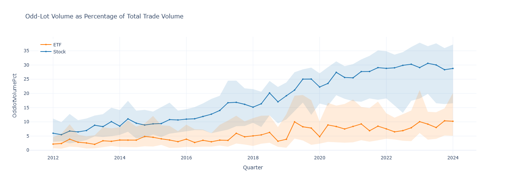
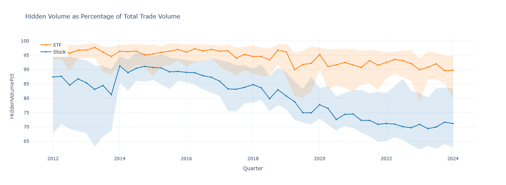
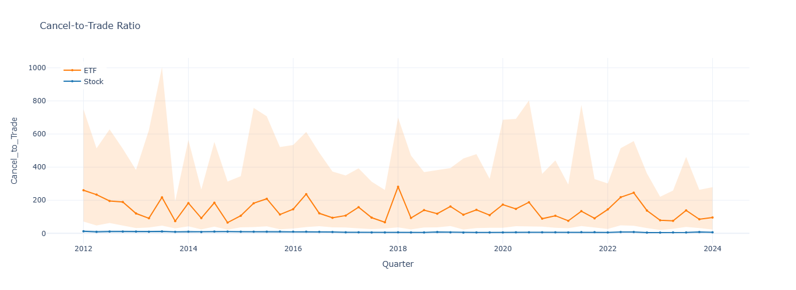
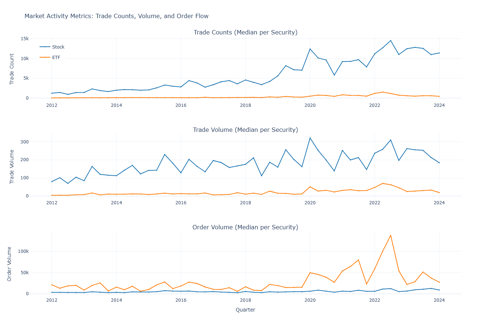
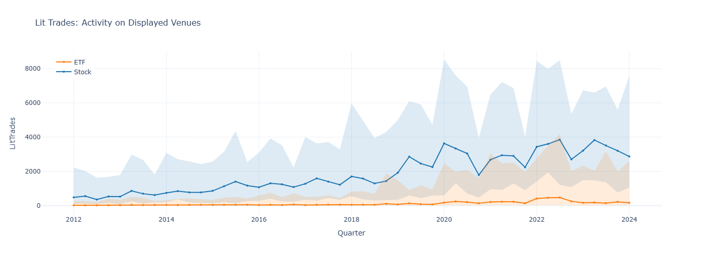

# Market Microstructure Evolution: A Decade of Trading Pattern Analysis

**Author:** Emma Nagy  
**Date:** August 2024  
**Data Source:** SEC MIDAS (2012Q1-2024Q1)

[](https://nbviewer.org/github/enagy827/market-microstructure-analysis/blob/main/market_microstructure_analysis.ipynb)
[](report/Portfolio_AI_AS1_Report.pdf)

---

## 📊 Project Overview

This project analyzes 12 years of SEC MIDAS data to understand how equity market microstructure evolved between 2012 and 2024. Using fixed-cohort sampling of 100 stocks and 100 ETFs tracked across 49 quarters, the analysis reveals five major patterns that challenge popular narratives about modern market structure.

## 🔍 Key Findings

1. **Odd-Lot Trading Revolution**: Odd-lot volume increased 381% in stocks (6.0% → 28.8%) and 369% in ETFs (2.2% → 10.2%), driven by retail democratization through commission-free trading and algorithmic order-splitting strategies.

2. **Market Transparency Renaissance**: Hidden liquidity declined from 87.4% to 71.2% for stocks and 96.3% to 89.8% for ETFs, contradicting widespread concerns about "dark pool proliferation" and demonstrating successful regulatory outcomes.

3. **Trading Efficiency Gains**: Cancel-to-trade ratios improved 47% for stocks (12.2 → 6.4) and 63% for ETFs (260.2 → 95.9), reflecting more sophisticated algorithms and improved market quality.

4. **Divergent Market Structures**: Stocks maintain 26x more trades than ETFs (11,370 vs 436 median per quarter) while ETFs show 3x larger order volumes ($27,531 vs $9,255), confirming stocks function as price-discovery engines while ETFs serve as block-trading instruments.

5. **Displayed Market Dominance**: Lit market trades grew 498% for stocks and 906% for ETFs, capturing the majority of overall market growth and proving displayed venues won the competition for order flow.

---

## 📁 Repository Contents

```
market-microstructure-analysis/
├── market-microstructure-analysis.ipynb         # Complete Jupyter notebook with analysis
├── cohort_descriptive_stats.csv                 # Processed statistics (49 quarters × 18 metrics)
├── outputs/
│   └── figures/                                 # Five key visualizations (PNG)
│       ├── key_viz_1_oddlot_volume_pct.png
│       ├── key_viz_2_hidden_volume_pct.png
│       ├── key_viz_3_cancel_to_trade.png
│       ├── key_viz_4_market_activity.png
│       └── key_viz_5_lit_trades.png
│   └── tables/
│       ├── cohort_descriptive_stats.csv
├── report/
│   └── Portfolio_AI_AS1_Report.pdf              # Comprehensive technical report
├── requirements.txt                             # Python dependencies
└── README.md                                    # This file
```

---

## 📈 Visualizations

### 1. Odd-Lot Trading Revolution

*Odd-lot volume as percentage of total trade volume. Stock odd-lots increased from 6.0% to 28.8%, while ETF odd-lots grew from 2.2% to 10.2%.*

### 2. Market Transparency Renaissance  

*Hidden volume as percentage of total trade volume. Shows sustained decline for both stocks (87.4% → 71.2%) and ETFs (96.3% → 89.8%), indicating improved market transparency.*

### 3. Trading Efficiency Gains

*Cancel-to-trade ratio over time. Stock ratios declined from 12.2 to 6.4 (-47%), while ETF ratios fell from 260.2 to 95.9 (-63%), reflecting more sophisticated order placement strategies.*

### 4. Divergent Market Structures

*Three-panel comparison of trade counts, trade volume, and order volume. Reveals fundamentally different market structures: stocks show 26x more trades (price discovery), while ETFs show 3x larger order volumes (block trading).*

### 5. Displayed Market Dominance

*Lit trades: activity on displayed venues. Shows strong growth in trades executed on transparent, displayed venues for both stocks (+498%) and ETFs (+906%).*

---

## 🚀 How to Run This Analysis

### View Online (No Installation Required)

**[View the interactive notebook on nbviewer →](https://nbviewer.org/github/enagy827/market-microstructure-analysis/blob/main/market_microstructure_analysis.ipynb)**

### Run Locally

#### Prerequisites
- Python 3.8 or higher
- Jupyter Notebook or JupyterLab

#### Option 1: Using Git

```bash
# Clone the repository
git clone https://github.com/enagy827/market-microstructure-analysis.git
cd market-microstructure-analysis

# Install dependencies
pip install -r requirements.txt

# Launch Jupyter
jupyter notebook

# Open market-microstructure-analysis.ipynb and run all cells
```

#### Option 2: Download ZIP

1. Click the green **"Code"** button at the top of this repository
2. Select **"Download ZIP"**
3. Extract the files to your desired location
4. Open terminal/command prompt and navigate to the extracted folder
5. Install dependencies: `pip install -r requirements.txt`
6. Launch Jupyter: `jupyter notebook`
7. Open `market-microstructure-analysis.ipynb` and run the cells

---

## 🛠️ Methodology

### Sampling Design
- **Fixed-cohort approach**: 100 stocks and 100 ETFs randomly sampled from 2012Q1 and tracked across all subsequent quarters
- **Rationale**: Controls for composition effects (IPOs, delistings, sector rotations) to ensure observed trends reflect behavioral changes rather than sample composition shifts
- **Trade-off**: Introduces survivorship bias but provides cleaner signal for behavioral evolution

### Data Processing
- **Winsorization**: Values capped at 1st and 99th percentiles to handle outliers while preserving sample size
- **Undefined ratios**: When denominators equal zero, ratios set to NaN rather than zero (mathematically undefined)
- **Statistical approach**: Median-based analysis with interquartile ranges (p25-p75) for robustness to outliers

### Metrics Analyzed (18 total)

**Trade counts:**
- Total trades, lit trades (displayed venues), odd-lot trades (<100 shares), hidden trades (non-displayed orders), trades involving hidden volume

**Volume metrics:**
- Order volume, trade volume, lit volume, odd-lot volume, hidden volume, trade volume associated with hidden orders

**Derived ratios:**
- Cancel-to-trade ratio (cancelled orders / executed trades)
- Trade-to-order-volume ratio (trade volume / order volume)  
- Hidden rate (% of trades involving hidden orders)
- Hidden volume percentage (% of trade volume that is hidden)
- Odd-lot rate (% of trades that are odd-lots)
- Odd-lot volume percentage (% of trade volume from odd-lots)

---

## 💻 Technologies Used

- **Python**: Core programming language
- **Pandas**: Data manipulation and analysis
- **NumPy**: Numerical computations
- **Plotly**: Interactive visualizations
- **Jupyter**: Reproducible analysis environment
- **LaTeX**: Professional report generation

---

## 🎯 Key Insights

This analysis challenges conventional wisdom about modern market structure:

- **Markets became MORE transparent**, not less — hidden liquidity declined 16-19 percentage points despite widespread concerns about "dark pool proliferation"
- **Markets became MORE efficient** — cancel-to-trade ratios improved 47-63%, showing more sophisticated order placement strategies
- **Retail participation exploded** — odd-lot trading grew 380%+ driven by commission-free trading platforms (Robinhood 2013, major brokers 2019)
- **Displayed venues won** — lit markets captured 500-900% growth, demonstrating that transparent trading venues won the competition for order flow
- **Stocks and ETFs serve distinct roles** — stocks function as price-discovery engines with fragmented flows (26x more trades), while ETFs serve as block-trading instruments for institutional portfolio strategies (3x larger order volumes)

### Implications

**For Traders:** Displayed markets now offer competitive execution quality while providing transparency benefits. Order submission strategies have become dramatically more efficient.

**For Regulators:** Declining hidden percentages provide evidence that transparency initiatives succeeded. The shift toward displayed venues validates regulatory pressure for market transparency.

**For Researchers:** Stocks and ETFs require different analytical frameworks given their divergent order flow patterns. Empirical analysis can reveal patterns that contradict popular narratives.

---

## 📄 Technical Report

For detailed methodology, statistical analysis, comprehensive discussion, and full bibliography, see the complete technical report:

**[Download PDF Report →](/report/Portfolio_AI_AS1_Report.pdf)**

---

## 📊 Data Source

**SEC MIDAS (Market Information Data Analytics System)**

- **Coverage**: 5,000+ securities (individual stocks and ETFs)
- **Time Period**: 2012Q1 through 2024Q1 (49 consecutive quarters)
- **Granularity**: Quarterly aggregated trade and order metrics
- **Source**: https://www.sec.gov/marketstructure/midas

MIDAS provides comprehensive order and trade-level data used by the SEC for market structure analysis and regulatory oversight.

---

## 📚 Project Context

This project was completed as part of academic coursework demonstrating proficiency in:
- Market microstructure analysis
- Large-scale data processing and statistical analysis
- Time series analysis and visualization
- Financial data interpretation
- Technical writing and communication

The analysis addresses three key research questions:
1. How have trading patterns evolved differently for stocks versus ETFs?
2. What role has algorithmic trading played in changing market microstructure?
3. Have markets become more or less transparent over time?

---

## 🔗 Contact

For questions, collaboration opportunities, or to discuss this research:

- **Portfolio**: [[emmanagy.net](https://www.emmanagy.net/)]
- **LinkedIn**: [[Emma Nagy](https://www.linkedin.com/in/emma-nagy/)]

---

## 📝 Citation

If you use this analysis or methodology in your research, please cite:

```
Nagy, E. (2024). Market Microstructure Evolution: A Decade of Trading Pattern Analysis (2012-2024). 
Analysis of SEC MIDAS data examining structural changes in equity markets.
https://github.com/enagy827/market-microstructure-analysis
```

---

## 📜 License

This project is available for educational and research purposes. Please credit appropriately if you use this work.

---

*Last updated: December 2024*
